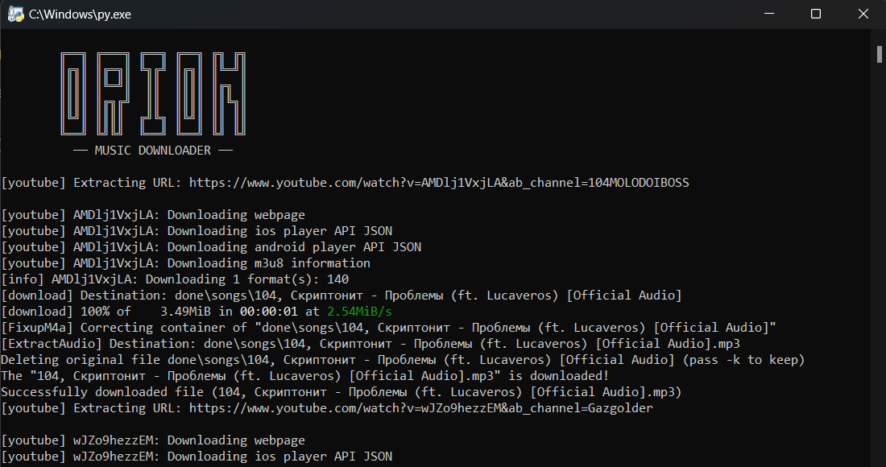

# Orion Music Downloader

A python program to download songs from YouTube in `mp3` container format and automatically set album cover & ID3 tags for them. Application can save a lot of time, because you don't have to search information about song, download its album art and use other programs to deal with it on your own.

<picture>
  <source media="(prefers-color-scheme: dark)" srcset="assets/darkmode.png">
  <source media="(prefers-color-scheme: light)" srcset="assets/lightmode.png">
  
</picture>

## Required

Make sure you have installed below in your PC or have added into the PATH:

- FFMPEG ([download](https://ffmpeg.org/download.html))
- Python version > 3.x.x ([download](https://www.python.org/downloads/))

## Installing

You can clone this project to your pc, using the following command:

```python
git clone https://github.com/koniziwa/orion-music-downloader.git
```

or you're not using git. Then you can just download the source in `.zip` format and extract it.

Also you have to install all dependencies that need to run the program. You can do it with `pip` or `pip3`, just use the command:

```python
pip install -r requirements.txt
```

Now you can run the program.

## Usage

Firstly, you need to enter required song YouTube video url into the file named `links.txt`, which is located at `(project-folder)/done/links.txt`.


After that, in the main folder find the file named `orion.py` and open it, using python.



Finally (if no errors happened), you will see the message:

```
PRESS ANY KEY TO CLOSE THIS WINDOW
|
```

Then you can see two folders in `done/` — `covers/` and `songs/`, where every song has the following ID3 tags:

1. Title
2. Artist
3. Album
4. Albumartist

Then you can add this tracks to your iTunes audio library and drop it to phone to enjoy new great sound!


